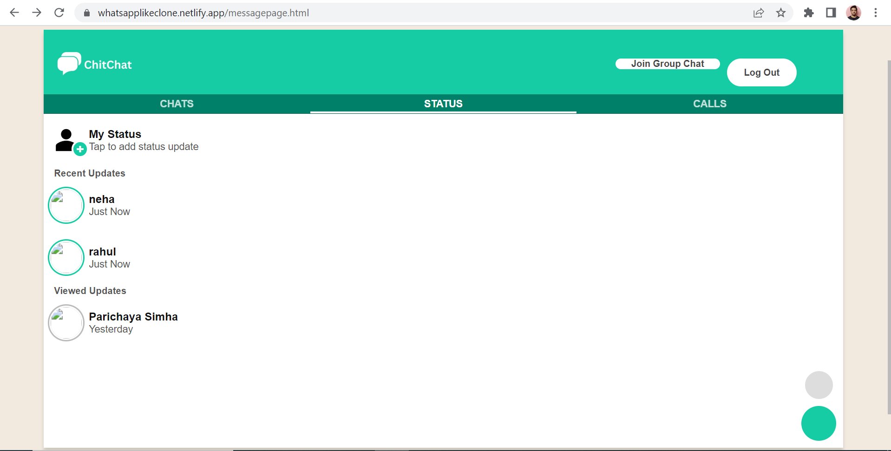

### 

# [ChitChat](https://whatsapplikeclone.netlify.app/)

ChitChat.com is basic Chat application inspired from Whatsapp which provide private chat and group chat with other users.

# Tech Stack

Frontend-> HTML, CSS, JavaScript

Backend-> NodeJS, Express, Nodemon, Mongoose, Socket.io, dotenv, passport, passport-google-oauth20

DataBase-> MongoDB

# Features

Google OAuth Authentication

Status

Private Chat

Group Chat

[Admin Side](https://whatsapplikeclone.netlify.app/admin/adminpage.html)

# Features of Admin Side

 Admin can see all the users and block the users as well

# HomePage

# Contact

# Status

# Admin

