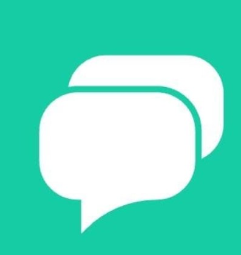
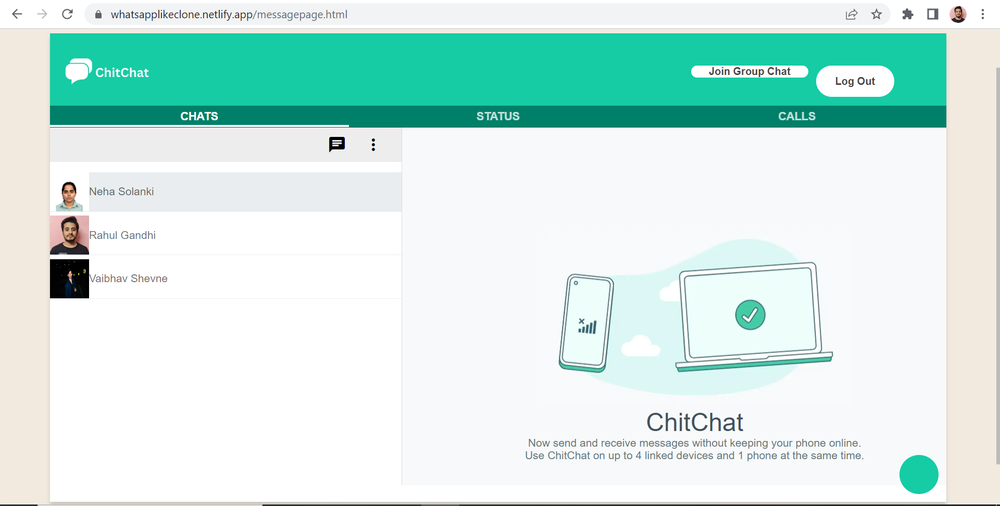
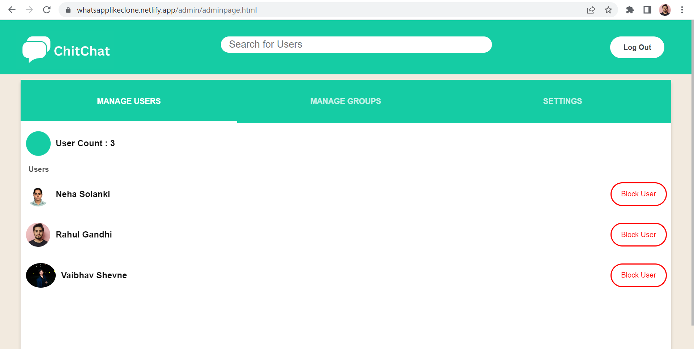

### 

# [ChitChat](https://whatsapplikeclone.netlify.app/)

ChitChat.com is basic Chat application inspired from Whatsapp which provide private chat and group chat with other users.

# Tech Stack

Frontend-> HTML, CSS, JavaScript

Backend-> NodeJS, Express, Nodemon, Mongoose, Socket.io, dotenv, passport, passport-google-oauth20

DataBase-> MongoDB

# Features

Google OAuth Authentication

Status

Private Chat

Group Chat

[Admin Side](https://whatsapplikeclone.netlify.app/admin/adminpage.html)

# Features of Admin Side

 Admin can see all the users and block the users as well

# HomePage

# Contact

# Status

# Admin

# How to use 

Vistit on messagepage and click on your and for the other person do the same they can chat with each other.

# API Endpoints

### User Routes
    - User Register :- /user/register 
        - Method : POST
        - Body : name, email, password
    - User Login :- /user/login
        - Method : POST
        - Body : email, password
        
### Admin Routes
    - Get All Users :- /user/all
        - Method : GET
    - Get User by their ID :- /user/id (Pass ID in params)
        - Method : GET 
    - Delete a User by their ID :- /user/id (Pass ID in params)
        - Method : DELETE

